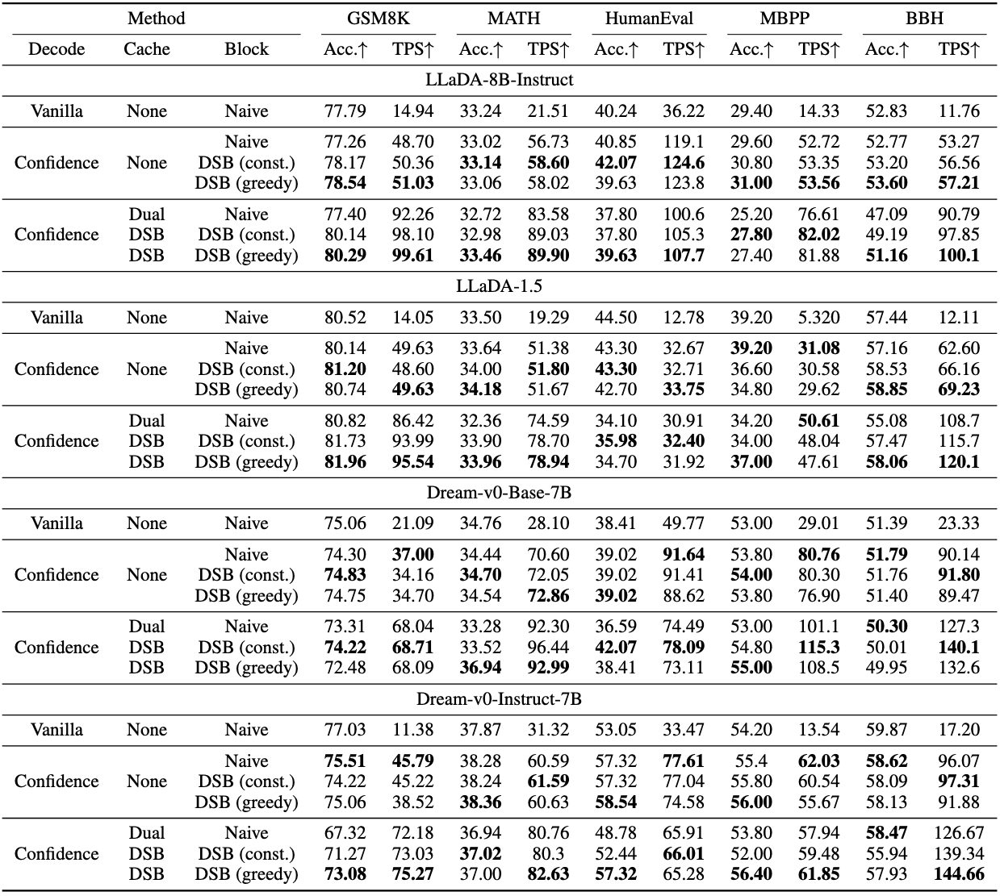

# DSB: Dynamic Sliding Block Scheduling for Diffusion LLMs

We propose Dynamic Sliding Block (DSB) and DSB Cache, a training-free block scheduling and KV-cache scheme for diffusion LLMs that improves both generation quality and inference efficiency.


## Project Structure

```
.
├── dream/          # Dream model related code
├── llada/          # LLaDA model related code
└── .gitignore      # Git ignore configuration
```

## Environment
- Python 3.10.12
- NVIDIA GPU + CUDA 12.1 compatible driver

## Install

1) Install PyTorch (CUDA 12.1 wheels):
```bash
pip install --index-url https://download.pytorch.org/whl/cu121 \
  torch==2.5.1+cu121 torchvision==0.20.1+cu121 torchaudio==2.5.1+cu121
```

2) Install the rest:
```bash
pip install -r requirements.txt
```

## Eval

We provide the eval scripts for the main experiment, you can reproduce it directly. For example:
```bash
cd llada
bash eval_instruct.sh
```
The main result:


## Acknowledgements

We would like to thank the authors of [LLaDA](https://github.com/llada-project/llada), [Dream](https://github.com/dream-project/dream) and [Fast-dLLM](https://github.com/NVlabs/Fast-dLLM) for their excellent work and open-source contributions.
